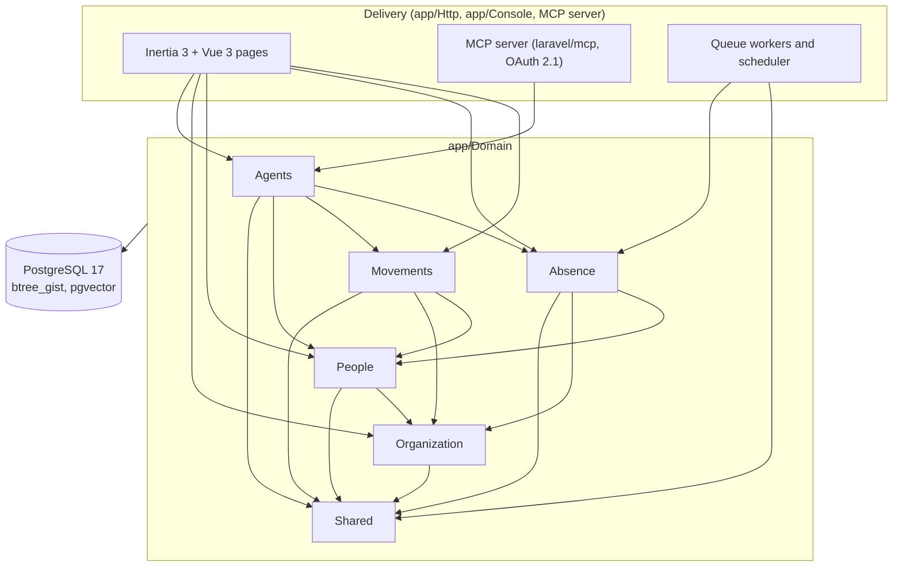

# Architecture

This document is the map. It names the parts of Sunex, the rules for how they depend on each other,
and the four invariants every change must keep. The detailed design of v1 is
[TDD-0001](docs/tdd/0001-v1-architecture.md); the reasons behind each choice are in
[docs/adr/](docs/adr/).

## Shape of the system

Sunex is a modular monolith: one Laravel 13 application, one PostgreSQL 17 database, one deploy.
Inside it, code is split into **bounded contexts**, each a namespace under `app/Domain/` with its
own models, tables and public contracts. The boundaries are enforced by Pest architecture tests,
not by packages ([ADR-0004](docs/adr/0004-domain-namespaces-with-architecture-tests.md)).



Runtime processes: the web server (Inertia app and the MCP endpoint; Sunex sends webhooks but
receives none), queue workers (outbox relay, webhook delivery, agent runs, embeddings) and the
scheduler (períodos aquisitivos, deadline reminders, outbox pruning).

## Bounded contexts

| Context | Owns | Public surface (`Contracts`, events) | May depend on |
|---|---|---|---|
| **Shared** | Shared kernel: Brazilian identifiers (CPF, CNPJ, CBO), date ranges, the clock and the business `Calendar` interface, the access-control primitives (principal, capability, decision, the policy function), the approval engine, audit conventions, the integration outbox, webhooks and CSV exports | `Authorizer`, `ReachResolver` (interface), `ApprovalEngine`, `Outbox`, value objects | the framework only |
| **Organization** | Companies (employers, by CNPJ) and establishments, org units and their effective-dated tree, positions with CBO codes, holidays (implementing the `Calendar`) | `CompanyDirectory`, `OrgTree` (as of a date), `PositionDirectory` | Shared |
| **People** | Persons (by CPF), employments (matrícula per company), **bitemporal employment versions**, eSocial identifiers and admission readiness, reach resolution (manager chain and org-unit reach as of a date) | `EmploymentWriter`, `EmploymentReader` (as of / known at), `ReachResolver` implementation, `EmploymentVersionRecorded` event | Organization, Shared |
| **Movements** | Movement requests (admission, transfer, promotion, salary, schedule, manager change, termination), their approval flows and segregation of duties, application to employment versions | `RequestMovement`, `MovementApproved` event | People, Organization, Shared |
| **Absence** | Períodos aquisitivos, the férias ledger, férias requests, faltas and afastamentos, the CLT rules engine | `VacationBalance`, `DraftVacationRequest`, `SubmitVacationRequest`, absence events | People, Organization, Shared |
| **Agents** | Agent registry (owner, sponsor, mode, scopes), agent principals, the tool gateway, per-call audit, the `AgentRuntime` port, MCP tools, the two v1 agents and their knowledge base | Tool classes shared by in-app agents and the MCP server | Absence, Movements, People, Organization, Shared |

Rules that the architecture tests enforce:

1. A context uses another context only through that context's `Contracts` and `Events`
   namespaces. Models, actions and internal classes stay private to their context.
2. Dependencies point down the table above; no cycles. `Shared` depends on nothing in `app/Domain`.
   When a lower context needs something from a higher one, it declares an interface and the higher
   context implements it (the `ReachResolver` in Shared is implemented by People).
3. Each context owns its tables. Foreign keys across contexts are allowed for integrity (a
   version references a position), Eloquent relationships across contexts are not.
4. Screens that list data from several contexts read through query classes in `app/Http/Queries`
   (read-only, query builder). Writes always go through the owning context's actions.
5. Controllers, MCP tools and jobs are thin: they build input data, call one action or contract,
   and shape the output. Business rules live in `app/Domain`.

Inside a context the layout is the same everywhere:

```
app/Domain/<Context>/
  Actions/      one class per use case (RecordEmploymentChange, ApproveMovement…)
  Contracts/    the interfaces and DTOs other contexts may use
  Data/         input and output data objects
  Events/       domain events other contexts may listen to
  Models/       Eloquent models, private to the context
  Policies/     Laravel policies, all delegating to the Shared Authorizer
  Rules/        pure rule code with no I/O (the CLT férias rules live here)
```

## The four invariants

These hold everywhere in the code. A pull request that breaks one is rejected even if its tests
pass; each has its own ADR and its own tests.

### 1. Employment history is bitemporal and append-only

Every change to an employment (position, org unit, manager, salary, schedule, cost centre,
establishment) is an **employment version** with two ranges: when it is true in the world
(`valid_period`, a `daterange`) and when Sunex believed it (`recorded_period`, a `tstzrange`).
A correction is a new fact: the old row's recorded period is closed and a new row is inserted;
nothing else is ever updated or deleted. A PostgreSQL exclusion constraint forbids two rows for
the same employment that overlap in both ranges, so "what was true on date D, as we knew it at
time T" always has exactly one answer. Only employment versions are bitemporal; every other entity
is effective-dated plus the audit log
([ADR-0005](docs/adr/0005-bitemporal-employment-versions.md)).

### 2. One policy function for humans, agents and MCP clients

Every read and write is decided by `Shared\Access\Authorizer::decide(principal, capability,
subject, asOf)`. Roles grant capabilities; each grant carries a **reach** (self, direct reports,
manager chain, org unit, company, all companies) that is evaluated **as of a date** from employment versions; and
**field groups** decide which attributes are visible, so masked fields never leave the server.
Laravel policies, Inertia props, exports and the agent tool gateway all call the same function
([ADR-0006](docs/adr/0006-permission-model-roles-reach-field-groups.md)).

### 3. Agents are principals with an owner, a sponsor, a mode and a per-call audit

An agent is a registered principal, never a shared service account. It has an accountable owner,
a human sponsor, a mode (on behalf of the invoking user, or autonomous within the sponsor's
rights) and scopes. Its effective rights are the intersection of its scopes, the rights of the
human it acts for and the rights of its sponsor, so an agent never sees or does what its sponsor
(or the user who invoked it) could not. In-app agents and
external MCP clients use the **same tool classes** through one gateway, which writes an audit row
for every tool call inside the same database transaction as the change it caused. In v1 no agent
changes data without a human approval
([ADR-0007](docs/adr/0007-agents-as-principals-one-toolset.md),
[ADR-0008](docs/adr/0008-agent-runtime-laravel-ai-and-mcp.md)).

### 4. Outbound lifecycle events leave through a transactional outbox, signed

Facts that payroll needs (admission, contract change, absence, termination) are written to an
`outbox_messages` table in the same transaction as the domain change. A relay delivers them to
webhook subscribers with an HMAC-SHA256 signature over a timestamp and the raw body, with retries
and automatic disabling of failing endpoints. CSV exports shaped like the eSocial events S-2200,
S-2206, S-2230 and S-2299 are built from the same messages, so webhooks and files never disagree.
Sunex never generates eSocial XML and never transmits to eSocial
([ADR-0009](docs/adr/0009-no-payroll-no-esocial-transmission.md),
[ADR-0010](docs/adr/0010-transactional-outbox-signed-webhooks.md)).

## Cross-cutting concerns

| Concern | Approach |
|---|---|
| Multi-company | One installation holds several employers (CNPJs). Company-owned rows carry `company_id`; the company reach in the policy function and an architecture test on queries keep users inside the companies they are granted ([ADR-0011](docs/adr/0011-multi-company-single-installation.md)) |
| Dates and time | Business dates are `date` in the employer's calendar; ranges are inclusive in the domain and stored half-open (`[start, end + 1)`). Recorded time is `timestamptz` from an injected clock, so tests can travel in time |
| Audit | Every effective-dated entity is audited (who, when, before, after, reason). Employment versions are their own history. Agent tool calls have a dedicated audit table |
| Identifiers | ULID primary keys; CPF, CNPJ (numeric and the new alphanumeric format), matrícula and CBO are value objects with validation in `Shared\Identifiers` |
| Language | Code, docs and commits in English; Brazilian legal terms kept in Portuguese; UI copy in English behind translation keys, pt-BR later ([ADR-0012](docs/adr/0012-english-ui-copy-behind-translation-keys.md)) |
| Personal data | Health details are never stored: an afastamento keeps its eSocial motive code, dates and a document reference, never a diagnosis (CID) |

## Where to go next

- How v1 is built, table by table and phase by phase: [TDD-0001](docs/tdd/0001-v1-architecture.md).
- Which pull request comes next and what can run in parallel: [ROADMAP.md](.specs/project/ROADMAP.md).
- Why a decision was taken, and what would reverse it: [docs/adr/](docs/adr/).
