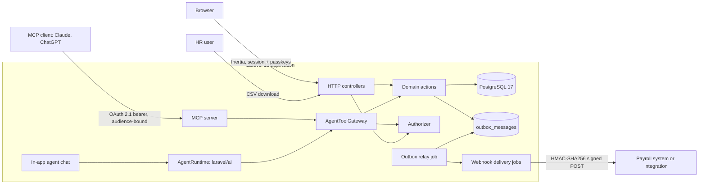
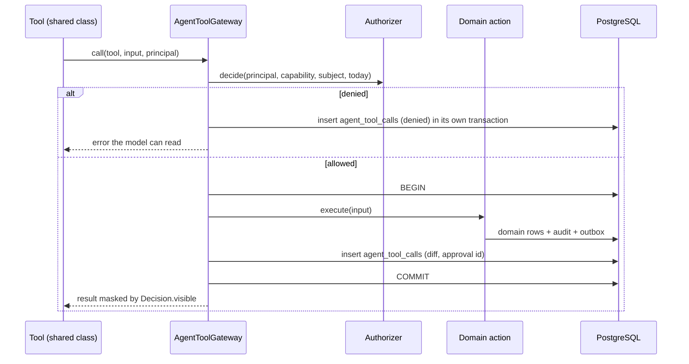
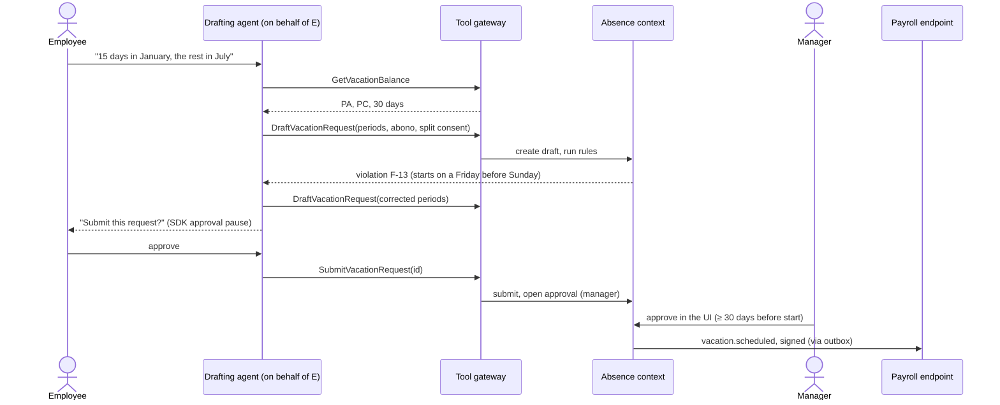

# TDD-0001: Sunex v1 architecture

- **Status:** Accepted, revisited at the end of every phase
- **Date:** 2026-10-02
- **Author:** Augusto Henriques
- **Scope:** the v1 row of the [product brief](../brief.md): bitemporal employment record,
  organization and positions, movements with approvals, férias and afastamentos, eSocial readiness
  and signed events, agent registry and MCP server, two agents
- **Decisions this design rests on:** [ADR-0002](../adr/0002-laravel-13-php-84-postgresql.md) to
  [ADR-0014](../adr/0014-agpl-license-public-repository.md)
- **Delivery:** the numbered phases in [§18](#18-implementation-phases) map onto PR-sized rows in
  [ROADMAP.md](../../.specs/project/ROADMAP.md)

## 1. Context

Brazilian employers keep employee data in two places: a payroll system that owns eSocial, and
spreadsheets or a people tool for everything around it. History is usually the current value plus
an audit log, so "what was this person's salary on 1 March, as we knew it when payroll closed" has
no reliable answer, and every movement or férias request is checked by hand against the CLT. AI
assistants are arriving in HR tools without an answer to "who is this agent, who is accountable
for it, and what did it do".

Sunex v1 answers those three problems in one module, done well: a dated, correctable employment
history; movements and férias that follow written rules and approvals; and agents that are
accountable users. It is the source of facts payroll needs, never the transmitter
([ADR-0009](../adr/0009-no-payroll-no-esocial-transmission.md)).

## 2. Goals and non-goals

### Goals (observable at the end of v1)

1. HR can answer **"what was true on date D, as we knew it at time T"** for any employment, with one
   query, and a correction never erases what was believed before.
2. Every employment change has an effective date, a recorded time, a reason and an approval chain
   that respects segregation of duties.
3. A férias request is validated against the CLT rules (articles 130 to 145) **when it is made**,
   and every rule in code cites its article and a stable rule id.
4. Admissions show their eSocial completeness before the start date; lifecycle facts leave Sunex
   as signed webhook events and as CSV files shaped like S-2200, S-2206, S-2230 and S-2299.
5. Humans, in-app agents and MCP clients are authorized by the same policy function; every agent
   tool call has an audit row written in the same transaction as its effect.
6. The demo path from the brief works end to end and is covered by a browser test: an agent drafts
   a férias request, the employee confirms, the manager approves, a signed event is delivered, and
   the audit trail is visible.

### Non-goals for v1

- Payroll, eSocial XML, eSocial transmission, people cost (later module), salary bands.
- Experiência, aviso prévio, desligamento deadlines beyond recording the termination, the LGPD
  toolset, the NR-1 psychosocial-risk register (later Brazil pack).
- Time clock, banco de horas, recruiting, SSO/SCIM, mobile app, SaaS sign-up.
- eSocial categories other than 101 (employee) and 103 (apprentice): domestic, temporary,
  intermittent and public-sector workers follow different rules.
- Férias coletivas (art. 139–141), art. 133 I (rehire within 60 days), F-20 paternity linkage
  (in force 2027-01-01), the Empresa Cidadã sharing and half-hours alternatives.
- Agents that change data without a human approval, autonomous agents with write scopes.
- pt-BR UI copy (a later roadmap row; v1 ships English copy behind translation keys).

## 3. Principles

The five product values of the brief, translated into engineering rules:

| Product value | Engineering rule |
|---|---|
| A fact has a date and a reason | Employment versions are bitemporal and append-only; every write carries a reason code; corrections are new rows ([ADR-0005](../adr/0005-bitemporal-employment-versions.md)) |
| One door for everyone | One `Authorizer::decide()`; controllers, Inertia props, exports and the agent tool gateway call it; masked fields never leave the server ([ADR-0006](../adr/0006-permission-model-roles-reach-field-groups.md)) |
| The source, not the transmitter | Integration events through a transactional outbox; eSocial-shaped payloads and CSV; no XML ([ADR-0010](../adr/0010-transactional-outbox-signed-webhooks.md)) |
| Brazil first, legible everywhere | CLT rules are pure functions in `Absence\Rules`, each citing a rule id from the rulebook and its article; Portuguese legal terms are kept and glossed |
| Depth over breadth | The database enforces what it can (exclusion constraints, checks, unique indexes); the rest is tested with tables of cases |

## 4. Architecture overview

The contexts, their dependency rules and the four invariants are in
[ARCHITECTURE.md](../../ARCHITECTURE.md). This section adds the runtime view.



Processes: one web process, queue workers (`default`, `outbox`, `webhooks`, `agents`, `embeddings`
queues) and the scheduler. Queue driver: the database driver in v1 (already configured by the
scaffold); Redis and Horizon are a later operations row, not a design dependency.

## 5. Conventions for every table

| Convention | Rule |
|---|---|
| Keys | ULID primary keys (`$table->ulid('id')->primary()`), ULID foreign keys |
| Company ownership | Company-owned tables carry a non-null `company_id`; composite indexes start with it |
| Business dates | `date` in the employer's calendar (config `sunex.business_timezone`, default `America/Sao_Paulo`) |
| Date ranges | Inclusive in the domain (`DateRange::of('2026-07-06', '2026-08-04')`), stored as PostgreSQL `daterange` half-open `[start, end + 1)`; an open end is an unbounded upper bound. Rulebook convention C-01 |
| Recorded time | `timestamptz`, taken from an injected `Clock` once per command |
| Money | `numeric(12,2)` plus an explicit unit; never floats |
| Facts | No soft deletes on facts. Effective-dated rows are closed, not deleted |
| Raw DDL | Range columns, exclusion constraints and triggers are written with `DB::statement` in migrations (the schema builder has `vector` but no range types) and covered by tests that expect `QueryException` |
| Extensions | `btree_gist` (equality inside GiST exclusion constraints) and `vector` (pgvector), enabled by the first platform migration |
| Audit | Effective-dated entities log who, when, before, after and reason through `spatie/laravel-activitylog` 5, with a polymorphic causer that can be a user or an agent |

## 6. Organization

Organization owns the employers, where people work, and the seats they fill. It follows the
Workday and SuccessFactors split between the legal structure, the management structure and
positions ([research: Workday organization types and staffing models, SuccessFactors foundation
objects](https://www.workday.com/content/dam/web/en-us/documents/datasheets/organization-management-in-workday-datasheet-en-us.pdf)).

| Table | Columns (beyond id and timestamps) | Constraints |
|---|---|---|
| `companies` | `cnpj_root` (8 chars, the employer in eSocial), `legal_name`, `trade_name`, `status`, `empresa_cidada` (bool, Lei 11.770 extensions) | unique `cnpj_root` |
| `establishments` | `company_id`, `cnpj` (14 chars, upper-case, numeric or alphanumeric), `name`, `city_ibge_code`, `state`, `weekly_rest_day` (ISO weekday, default 7), `union_cnpj` (default `cnpjSindCategProf` for its employees) | unique `cnpj`; `left(cnpj, 8) = companies.cnpj_root` checked in the action |
| `org_units` | `company_id`, `code`, `kind` (directorate, department, team) | unique `(company_id, code)` |
| `org_unit_versions` | `org_unit_id`, `name`, `parent_id` (nullable), `valid_period daterange` | `EXCLUDE USING gist (org_unit_id WITH =, valid_period WITH &&)`; no cycle as of any date (checked in the action with a recursive query under a company-level advisory lock) |
| `positions` | `company_id`, `code`, `status` (open, frozen, closed) | unique `(company_id, code)` |
| `position_versions` | `position_id`, `title`, `cbo_code` (6 digits), `org_unit_id`, `valid_period daterange` | exclusion constraint as above |
| `holidays` | `scope` (national, state, municipal, company, establishment), `company_id`, `state`, `city_ibge_code`, `establishment_id` (each nullable, filled per scope), `date`, `name` | `UNIQUE NULLS NOT DISTINCT (scope, company_id, state, city_ibge_code, establishment_id, date)` |

Contracts: `OrgTree::subtree(OrgUnitId, Date $asOf)`, `OrgTree::pathToRoot(...)`,
`PositionDirectory::find(PositionId, Date $asOf)`, and the implementation of `Shared\Time\Calendar`
per establishment (holidays, weekly rest day, business days; rulebook C-04: holidays and rest days are injected, never hard-coded; national holidays from
Lei 662/1949 art. 1 are seeded, the others are configuration).

v1 does not enforce headcount per position (a position may have several incumbents); a warning is
shown when a second incumbent is assigned. Position budgeting belongs to the people-cost module.

## 7. People and the bitemporal employment record

### 7.1 Persons and employments

| Table | Columns | Constraints |
|---|---|---|
| `persons` | `cpf` (11 digits), `full_name`, `social_name`, `birth_date`, `nationality`, `personal_email`, `personal_phone`, `address` (jsonb) | unique `cpf`; CPF check digits validated by the `Cpf` value object |
| `employments` | `person_id`, `company_id`, `matricula` (≤ 30 chars), `esocial_category` (Tabela 01 code, e.g. 101), `admission_date`, `termination_date` (nullable), `termination_reason_code` (nullable) | unique `(company_id, matricula)`; `termination_date >= admission_date` |
| `users` (from the starter kit) | adds `person_id` (nullable, unique) | an HR user who is not an employee has no person |

A person is global to the installation: one CPF, possibly several employments (a rehire, or two
companies of the same group). Person fields are current state plus the audit log in v1; S-2205
(cadastral changes) is a later event.

### 7.2 Employment versions

```sql
CREATE TABLE employment_versions (
    id                    char(26) PRIMARY KEY,           -- ULID
    employment_id         char(26) NOT NULL REFERENCES employments(id),
    valid_period          daterange NOT NULL,             -- when it is true in the world
    recorded_period       tstzrange NOT NULL,             -- when Sunex believed it
    position_id           char(26) NOT NULL REFERENCES positions(id),
    org_unit_id           char(26) NOT NULL REFERENCES org_units(id),
    establishment_id      char(26) NOT NULL REFERENCES establishments(id),
    manager_employment_id char(26) NULL REFERENCES employments(id),
    cbo_code              char(6)  NOT NULL,              -- snapshot from the position
    salary_amount         numeric(12,2) NOT NULL,
    salary_unit           text NOT NULL,                  -- hour, day, week, fortnight, month, task
    weekly_hours          numeric(4,2) NOT NULL,
    schedule_description  text NOT NULL,
    cost_centre_code      text NULL,
    contract_type         text NOT NULL,                  -- indeterminate | fixed_term
    contract_end_date     date NULL,                      -- required when fixed_term
    reason_code           text NOT NULL,                  -- admission, transfer, promotion, salary_change,
                                                          -- schedule_change, manager_change, cost_centre_change,
                                                          -- termination, correction, rescission
    reason_note           text NULL,
    source_type           text NULL,                      -- e.g. 'movement'
    source_id             char(26) NULL,
    supersedes_version_id char(26) NULL REFERENCES employment_versions(id),
    recorded_by_type      text NOT NULL,                  -- user | agent | system
    recorded_by_id        char(26) NULL,
    CONSTRAINT employment_versions_no_overlap EXCLUDE USING gist (
        employment_id WITH =, valid_period WITH &&, recorded_period WITH &&),
    CONSTRAINT valid_period_not_empty CHECK (NOT isempty(valid_period)),
    CONSTRAINT recorded_period_starts CHECK (NOT lower_inf(recorded_period)),
    CONSTRAINT recorded_period_not_empty CHECK (NOT isempty(recorded_period)),
    CONSTRAINT manager_is_not_self CHECK (manager_employment_id IS DISTINCT FROM employment_id)
);
CREATE INDEX employment_versions_current ON employment_versions
    USING gist (employment_id, valid_period) WHERE upper_inf(recorded_period);
```

A trigger makes the table append-only: `DELETE` raises; `UPDATE` raises unless the only change is
closing an open `recorded_period` (upper bound from infinity to a timestamp strictly greater than
its lower bound). Together with the
exclusion constraint this gives the guarantee of the invariant: for each employment, date and
moment of knowledge there is at most one row, and history is never rewritten.

### 7.3 Reading: as of and known at

```php
interface EmploymentReader
{
    /** What was true on $on, as Sunex believed at $knownAt (default: now). */
    public function versionOn(EmploymentId $id, Date $on, ?Instant $knownAt = null): ?EmploymentVersionData;

    /** The whole valid-time timeline, as believed at $knownAt. */
    public function timeline(EmploymentId $id, ?Instant $knownAt = null): Timeline;

    /** Every row ever recorded, for the history screen and audits. */
    public function allFacts(EmploymentId $id): Collection;
}
```

The SQL behind `versionOn` is `valid_period @> :on::date AND recorded_period @> :knownAt::timestamptz`
(the casts matter: an untyped parameter is parsed as a range literal and fails). The
current-belief partial index serves the common case (`knownAt = now`). List screens join a
`current_employment_versions` view (current belief, valid today) instead of loading timelines.

### 7.4 Writing: change, correction, rescission

All writes go through `People\Contracts\EmploymentWriter`, called by Movements when an approval
completes, and by HR corrections. One write is one transaction:

1. `SELECT … FROM employments WHERE id = ? FOR UPDATE` serializes writers per employment.
2. Only then capture `recordedAt = clock->now()`, once; reading the clock before the lock would
   let a writer that waited close a row with a timestamp older than the row's own start.
3. Load the current-belief timeline.
4. A pure `TimelinePlanner` (no I/O) returns a plan: rows to close and rows to insert.
5. Close: `recorded_period = tstzrange(lower(recorded_period), :recordedAt)` on each closed row.
6. Insert the new rows with `recorded_period = [recordedAt, ∞)`.
7. Validate the result (manager chain without cycles as of each affected date; references valid
   as of the effective date), dispatch `EmploymentVersionRecorded` (in-transaction listeners write
   the audit entry and the outbox message), commit.

The planner handles three operations:

| Operation | Input | Plan |
|---|---|---|
| **Change** effective D | attribute delta, reason | Split the version valid on D at D: close it, re-insert its part before D unchanged and its part from D with the delta applied. Later versions (future-dated) are re-asserted with **forward propagation**: an attribute in the delta is overwritten in a later version only if that version still holds the value being replaced; values that were deliberately changed later are kept |
| **Correction** of version V | corrected attributes, reason | Close V and insert a row with the same `valid_period`, the corrected attributes, `reason_code = correction` and `supersedes_version_id = V` |
| **Rescission** of version V | reason | Close V and re-assert the previous version with its valid period extended over V's range (`reason_code = rescission`) |

Worked example (salary in R$; "now" in the recorded column is the moment of each write):

| Step | What HR does | Current belief after the write |
|---|---|---|
| 1 | Admission on 2026-01-05, salary 5,000 (recorded 01-02) | [01-05, ∞) 5,000 |
| 2 | Future-dated transfer on 2026-06-01 to team B (recorded 03-10) | [01-05, 06-01) 5,000 A; [06-01, ∞) 5,000 B |
| 3 | Retroactive raise to 5,500 effective 2026-03-01 (recorded 04-02) | [01-05, 03-01) 5,000 A; [03-01, 06-01) 5,500 A; [06-01, ∞) **5,500** B (propagated: it still held 5,000) |
| 4 | Correction: the raise was 5,400 (recorded 04-15) | [03-01, 06-01) 5,400 A and [06-01, ∞) 5,400 B, each superseding the 5,500 rows |

After step 4, `versionOn(2026-03-15, knownAt: 2026-04-10)` still answers 5,500: what Sunex believed
when, for instance, payroll closed March. This is the case bitemporality exists for
([Fowler, Bitemporal History](https://martinfowler.com/articles/bitemporal-history.html)).

Concurrency and clocks: the row lock serializes writers, and the clock is read after the lock, so
each write's `recordedAt` is later than every row it closes. If two application servers' clocks
still disagree, closing a row at or before its own start would produce an inverted or empty range:
PostgreSQL rejects the inverted one, and the `recorded_period_not_empty` check and the trigger
reject the empty one, so the write fails instead of erasing a belief. The writer also asserts
`recordedAt > lower(recorded_period)` of every row it closes and retries once after re-reading the
clock. The planner is unit-tested with tables of timelines; the
constraint and trigger are feature-tested against PostgreSQL.

### 7.5 eSocial identifiers and admission readiness

Sunex stores the source data of an S-2200 and checks it before the start date. The ready-gate
list is the rulebook's rule **E-01**, taken field by field from the S-1.3 leiaute
([leiautes S-1.3](https://www.gov.br/esocial/pt-br/documentacao-tecnica/leiautes-esocial-v-s-1-3-nt-07-2026-rev-24-09-2026)).
v1 covers CLT employees under the RGPS with **eSocial category 101 (employee) or 103
(apprentice)** only; other categories change the férias and eSocial rules and are out of scope.

| Field (leiaute tag) | Where it lives | Validation in Sunex |
|---|---|---|
| CPF (`cpfTrab`) | `persons.cpf` | 11 digits, check digits; the only worker key since eSocial 1.0 |
| Name, sex, race/colour, education (`nmTrab`, `sexo`, `racaCor`, `grauInstr`) | `persons` | `racaCor` 6 ("not informed") is rejected for admissions from 2024-04-22; stored under a legal-obligation basis and visible only to HR (`personal` field group) |
| Birth date, birth country, nationality (`dtNascto`, `paisNascto`, `paisNac`) | `persons` | country codes from Tabela 06; birth before admission |
| Address in Brazil (`cep`, `codMunic`, `uf`, …) | `persons.address` | CEP with 8 digits, IBGE municipality code |
| Matrícula (`matricula`) | `employments.matricula` | unique per company; must not start with "eSocial" |
| Category (`codCateg`) | `employments.esocial_category` | 101 or 103 in v1 |
| Admission data (`dtAdm`, `tpAdmissao`, `indAdmissao`, `tpRegJor`, `natAtividade`) | `employments` and the admission movement | values from the leiaute's lists |
| Union (`cnpjSindCategProf`) | `establishments.union_cnpj`, overridable per employment | a valid 14-character CNPJ; mandatory |
| Workplace (`localTrabGeral/nrInsc`) | version → establishment CNPJ | the establishment must exist (it is the employer's S-1005 table, kept by payroll) |
| Job title and CBO (`nmCargo`, `CBOCargo`) | position version → snapshot on the version | CBO with 6 digits |
| Salary (`vrSalFx`, `undSalFixo`) | version | amount > 0; unit 1–7 (hour, day, week, fortnight, month, task, not applicable) |
| Contract (`tpContr`, `dtTerm`) | version (`contract_type`, `contract_end_date`) | fixed-term requires an end date |
| Working hours (`qtdHrsSem`, `tpJornada`, `tmpParc`, `dscJorn`) | version | part-time ceilings (≤ 30 or ≤ 26 hours) for admissions from 2026-11-23, per NT 07/2026 |
| CNPJ (employer root, establishment, union) | `Cnpj` value object | numeric check digits; the alphanumeric CNPJ announced by the Receita Federal for 2026 is accepted by the same value object (algorithm **to verify** against the primary source) |

The **admission readiness checklist** is a pure function over a draft admission that returns the
missing or invalid items by tag. An admission movement cannot be approved while the checklist has
errors, and the HR dashboard lists admissions starting in the next 15 days with their state and
their S-2200 deadline: the day before work starts (rule E-02; with an S-2190 pre-registration, the
15th of the next month).

### 7.6 eSocial deadlines

Payroll transmits, but HR needs to know when each fact must reach payroll. A pure
`EsocialDeadlines` service computes the deadline of every outbound fact from the rulebook's
E-rules, on a business-day calendar (Monday to Friday minus national holidays, with an override
list; convention C-05). The direction of the shift is a per-event parameter, because the MOS moves
deadlines in different directions:

| Event | Deadline | Non-business last day |
|---|---|---|
| S-2200 (E-02) | the day before work starts | — |
| S-2206 (E-03) | the 15th of the month after the change | moved **later** |
| S-2230 (E-04) | by case: férias before the start; illness and accidents by the 15th of the next month or around day 16, per the MOS cases | moved **later** |
| S-2299 (E-05) | 10 days after the termination, the termination day excluded | moved **earlier** |

Each outbound message carries its computed `esocial_deadline`, and dashboards sort by it.

## 8. Movements and approvals

### 8.1 The approval engine (Shared\Approvals)

Movements and férias both need multi-step approvals with segregation of duties, and module 2 will
need them again, so the engine lives in Shared and knows nothing about HR. It resolves approvers
through the `ReachResolver` interface that People implements.

| Table | Columns | Constraints |
|---|---|---|
| `approval_requests` | `company_id`, `subject_type`, `subject_id`, `flow`, `status` (pending, approved, rejected, cancelled), `requested_by_user_id`, `requested_via_agent_id` (nullable), `decided_at` | one pending request per subject |
| `approval_steps` | `approval_request_id`, `position`, `approver_rule`, `status` (waiting, active, approved, rejected, skipped), `assigned_user_id`, `decided_by_user_id`, `decided_at`, `comment`, `requester_user_id` (denormalized) | unique `(approval_request_id, position)`; unique `(approval_request_id, decided_by_user_id)`; `CHECK (decided_by_user_id IS NULL OR decided_by_user_id <> requester_user_id)` |

Steps run in sequence. When a step becomes active its approver is resolved **as of that day**:

| Rule | Resolves to |
|---|---|
| `manager_of_subject` | the subject's manager in the current-belief version valid today |
| `skip_level_manager` | that manager's manager |
| `hr_of_company` | any user holding `movements.approve` with company reach over the subject (a shared queue) |

Segregation of duties, and where each rule is enforced:

| Rule | Enforced by |
|---|---|
| The requester never approves their own request | DB check constraint + `Authorizer` |
| One person decides at most one step of a request | DB unique index |
| The subject of a request never approves it | `Authorizer` (subject's user ≠ decider) |
| When the resolved manager is the requester, the step goes to the skip-level manager; with no manager, to HR | resolver, table-tested |
| Agents never hold an approval capability | `Capability::isHumanOnly()` + `Authorizer` + architecture test on agent scopes |
| A salary change needs two distinct humans (manager, then HR) | flow definition + unique index |

### 8.2 Movement types

A movement is a request to change an employment, with an effective date and a reason. Types are
PHP classes registered in one map; each declares the attributes it may change, its input data,
its approval flow and the outbound event family it produces.

| Type | Changes | Flow | Outbound event |
|---|---|---|---|
| `admission` | creates the person (if the CPF is new), the employment and its first version | HR | `employment.admitted` (S-2200 shape) |
| `transfer` | org unit, position, establishment, manager | manager → HR | `employment.changed` |
| `promotion` | position, CBO, salary | manager → HR | `employment.changed` |
| `salary_change` | salary amount or unit | manager → HR | `employment.changed` |
| `schedule_change` | weekly hours, schedule | manager → HR | `employment.changed` |
| `manager_change` | manager | HR | `employment.changed` |
| `cost_centre_change` | cost centre | HR | `employment.changed` |
| `termination` | closes the employment on a date with a reason code | HR | `employment.terminated` (S-2299 shape) |
| `correction` | corrects a recorded version (HR only, mandatory note) | HR → second HR | `employment.corrected` |

`employment.changed` carries `esocial_relevant: true` when an attribute that S-2206 reports
changed (salary, unit, CBO/position, weekly hours, schedule, contract type); the exact list is
**to verify** against the S-2206 leiaute and is kept in one configuration map.

Movement lifecycle: `draft → submitted → approved → applied`, with `rejected` and `cancelled` as
terminal states. A PHP enum holds the states and an explicit transition table tested
exhaustively. Approval and application happen in one transaction: the final approval calls
`EmploymentWriter`, which records the version (future-dated when the effective date is ahead),
the audit entry and the outbox message. A future-dated movement can be cancelled before its
effective date, which rescinds the version.

| Table | Columns |
|---|---|
| `movements` | `company_id`, `employment_id` (null for a draft admission), `type`, `effective_date`, `payload` (jsonb, validated by the type's data class), `reason_code`, `reason_note`, `status`, `requested_by_user_id`, `requested_via_agent_id`, `approval_request_id`, `applied_version_id` |

## 9. Absence: férias and afastamentos

All statutory rules here come from the rulebook described in
[§11](#11-statutory-rules-and-the-rulebook); rule ids (F-01…F-20, A-…, E-…) are cited in code and
in test datasets.

### 9.1 Data model

| Table | Columns | Constraints |
|---|---|---|
| `acquisition_periods` (períodos aquisitivos) | `employment_id`, `previous_id`, `period daterange` (PA), `concession_period daterange` (PC), `status` (running, completed, lost, paused), `lost_reason` (art133_ii, art133_iii, art133_iv), `paused_days`, `entitlement_days` (set when the PA completes) | `EXCLUDE USING gist (employment_id WITH =, period WITH &&)`; unique `previous_id` |
| `absence_records` | `employment_id`, `kind` (falta, afastamento, ferias), `period daterange`, `esocial_reason_code` (Tabela 18; 15 for férias; null for faltas), `counts_as_falta` (bool), `justified_by_employer` (bool), `illness_episode_id` (nullable), `document_ref` (nullable), `source_type`, `source_id`, `active` (bool) | `EXCLUDE USING gist (employment_id WITH =, period WITH &&) WHERE (active)`: one person cannot be in two absences on the same day |
| `illness_episodes` | `employment_id`, `reason_code` (01 or 03), `employer_days_used` (0–15), `inss_from` (nullable), `last_spell_end` | one open episode per employment and reason |
| `leave_type_rules` | `esocial_reason_code`, `duration_days`, `funding` (employer, inss, employer_reimbursed), `valid_period daterange`, `condition` (nullable, e.g. the 2029 fiscal target), `requires_empresa_cidada` | exclusion constraint on `(esocial_reason_code, valid_period)` |
| `vacation_requests` | `employment_id`, `acquisition_period_id`, `status` (draft, submitted, approved, rejected, cancelled, taken), `abono_days`, `abono_requested_on`, `split_consent_at`, `requested_by_user_id`, `requested_via_agent_id`, `approval_request_id`, `notice_date` | |
| `vacation_request_periods` | `vacation_request_id`, `period daterange`, `days`, `truncated_at` (nullable) | up to three per request |
| `leave_ledger_entries` | `acquisition_period_id`, `kind` (entitlement, enjoyment, abono, adjustment, reversal), `days` (signed), `source_type`, `source_id`, `recorded_at`, `recorded_by` | append-only; balance = sum |

Three design points come from the rulebook and change what earlier research assumed:

1. **Períodos aquisitivos are a chain, not admission anniversaries** (C-03, F-10). Each PA starts
   the day after the previous one ends; a loss under art. 133 starts a new PA on the return date;
   military service (code 29) and, by configurable default, unpaid leave (code 21) **pause** the PA
   and move its end by the days away. The rows are derived one from the other (`previous_id`),
   never recomputed from `admission_date`, and the eSocial `perAquis` of a férias event comes
   from them.
2. **One table for every absence.** Férias, afastamentos and faltas occupy the same calendar and
   eSocial forbids concurrent afastamentos (A-15), so one exclusion constraint forbids every
   overlap. When a new afastamento must start inside approved férias (a birth during férias), the
   application **truncates** the férias the day before, marks the period `truncated_at`, returns
   the unused days to the ledger and emits the corrected S-2230-shaped events, all in one
   transaction. Any other overlap is rejected and returned to HR as a conflict.
3. **Leave durations are effective-dated rules**, not constants. Licença-paternidade is 5 days
   paid by the employer and not reported to eSocial until 2026-12-31 (A-13); from 2027-01-01 it is
   an S-2230 afastamento (codes 46–52) of 10 days funded by the INSS, 15 from 2028 and 20 from
   2029 if the fiscal condition is met (A-14). Maternity is 120 days (A-08) with its extensions
   (codes 18, 35, 43). The rule in force on the event date applies; the Empresa Cidadã extensions
   need `companies.empresa_cidada`.

### 9.2 The rules engine

`App\Domain\Absence\Rules` is pure PHP with no database access. Its inputs are value objects (the
PA chain, the absences inside it, the requested periods, the abono, the consent, the calendar);
its outputs are entitlement, balance and a list of violations with stable codes.

| Rule | v1 behaviour |
|---|---|
| F-01, C-02, C-03 | PAs are chained; each ends the day before the 12-month anniversary of its own start (Código Civil art. 132 §3); a leap PA has 366 days |
| F-02, F-03 | Entitlement 30/24/18/12 by unjustified absences (faltas) dated inside the PA; 33 or more returns 0 with `art130_over_32` and asks HR to confirm; absences are never deducted from the férias period |
| F-04, F-05 | Only `absence_records` with `counts_as_falta = true` count; the art. 473 catalogue is the default configuration |
| F-08, F-09, F-10 | Paid leave over 30 days, or INSS-paid days over 180 inside the PA (spells summed, afastamentos crossing a PA boundary split), mark the PA lost; a new PA starts on the return date |
| F-11, F-15 | Requests must fall inside the PC; days after the PC end raise `ferias_em_dobro_risk`; a warning appears 60 days before the PC end when days are unscheduled |
| F-12 | Up to three periods with recorded consent; one ≥ 14 days, the others ≥ 5; feasibility checked against periods already approved for the same PA |
| F-13 | No period starts in the two days before a holiday or the employee's weekly rest day (per establishment) |
| F-14 | Approval at least 30 days before each period starts; the approval date is the notice date |
| F-16 | `payment_due_on = start − 2 days` is part of the férias event payload |
| F-17 | Abono up to one third of the entitlement, requested at least 15 days before the PA ends; a late request needs HR consent |
| A-01 to A-05 | The 15 employer-paid days belong to an **illness episode**: spells of the same cause within 60 days add up, so a relapse may move straight to the INSS (see §9.4) |
| A-08 to A-14 | Family leave durations come from `leave_type_rules` as of the event date |

Interpretations that the statute does not settle (33+ faltas, starting on the holiday itself,
summing shorter paid leaves, the 180-day reading of "6 meses", how unpaid leave affects the PA)
are listed in the rulebook's interpretation section, are configurable where the rulebook says so,
and surface in the UI as "calculated by Sunex; payroll is the system of record".

### 9.3 Férias flow

1. The scheduler extends the PA chain: it completes a PA on its last day (writing the entitlement
   to the ledger, `kind = entitlement`) and opens the next one.
2. An employee, a manager for a report, or the drafting agent creates a **draft** request; the
   rules run on every edit and return violations.
3. **Submit** opens an approval request (`manager_of_subject`).
4. **Approve** (≥ 30 days before start, F-14) writes the `absence_records` rows, debits the ledger
   (enjoyment and abono), records the audit entry and the outbox message `vacation.scheduled`,
   all in one transaction. Férias are themselves an S-2230 afastamento (code 15, with `perAquis`
   from the PA chain), which eSocial accepts up to 60 days ahead (E-06).
5. Cancelling an approved request reverses the ledger entries and deactivates the absence rows
   (`vacation.cancelled`); a truncation (§9.1) returns only the unused days.

### 9.4 Afastamentos

An afastamento has a Tabela 18 motive code, a start date, an end date (open while ongoing; the
end is the last day away, not the return day, E-09) and an optional document reference. **No
diagnosis or CID code is stored** (LGPD art. 11 treats health data as sensitive; storing the fact and
the dates is enough for eSocial and payroll).

| Rule | v1 behaviour |
|---|---|
| A-01, A-02 | For illness and accidents (codes 01 and 03) the employer pays the first 15 consecutive days and the INSS pays from the 16th (C-06: day 1 is the start date) |
| A-03, A-04, A-05 | The illness form asks one question: **is this the same cause as an absence in the last 60 days?** A yes attaches the spell to the open `illness_episode`, whose `employer_days_used` counter decides how many employer days remain; a relapse after day 15 goes to the INSS from its first day. No diagnosis is needed to answer it |
| E-07 | The same answer fills `infoMesmoMtv` on the S-2230-shaped event, mandatory from **2026-10-26** when a prior afastamento with the same code exists in the 60-day window |
| E-08 | Changing a spell between codes 01 and 03 is a correction that carries the `infoRetif` origin |
| A-07, F-09 | INSS-paid days are unpaid leave for the contract and count toward the 180-day loss rule of the PA they fall in |
| A-08 to A-15 | Maternity, its extensions, miscarriage, adoption and paternity follow `leave_type_rules`; a birth during férias truncates the férias (§9.1) |
| E-04 | `leave.started`, `leave.updated` and `leave.ended` carry the motive code, the dates and the computed deadline (§7.6) |

Motive codes are a seeded table from Tabela 18 for the absences v1 models: 01, 03, 15, 16, 17,
18, 19, 20, 21, 29, 35, 43, and 46–52 valid from 2027-01-01. Absences not listed in Tabela 18
(faltas, art. 473 absences, the 5-day paternity leave before 2027) are recorded but never
reported.

## 10. Outbound events: outbox, signed webhooks, CSV

### 10.1 Outbox

| Table | Columns |
|---|---|
| `outbox_messages` | `id` (ULID, also the event id), `company_id`, `aggregate_type`, `aggregate_id`, `sequence` (per aggregate, gap-free), `event_type`, `schema_version`, `effective_date`, `occurred_at`, `payload` (jsonb), `relayed_at` |
| `webhook_subscriptions` | `company_id`, `url` (https only), `event_types` (text[]), `secret` and `previous_secret` (encrypted casts), `previous_secret_expires_at`, `status` (active, disabled), `failure_count`, `disabled_at` |
| `webhook_deliveries` | `subscription_id`, `outbox_message_id`, `attempt`, `status` (pending, delivered, failed, abandoned), `next_attempt_at`, `response_status`, `response_excerpt`, `delivered_at` |

Each context publishes through `Shared\Integration\Outbox::record(IntegrationEvent)` inside its own
transaction; the per-aggregate `sequence` comes from a counter row locked in the same transaction.
The relay job claims unrelayed rows with `FOR UPDATE SKIP LOCKED`, creates one delivery per
matching subscription and marks the message relayed. Delivery jobs POST and retry with exponential
backoff for about three days; when a delivery exhausts that window the subscription is disabled,
its pending deliveries are kept for replay when an admin re-enables it, and company admins are
notified ([ADR-0010](../adr/0010-transactional-outbox-signed-webhooks.md); retry-then-disable is
the common pattern, for example [Deel](https://developer.deel.com/docs/webhook-event-types) and
[BambooHR](https://documentation.bamboohr.com/docs/webhooks)).

### 10.2 Event catalogue (v1)

| Event type | Emitted when | eSocial shape |
|---|---|---|
| `employment.admitted` | admission applied | S-2200 |
| `employment.changed` | change applied (with `esocial_relevant` and the changed attributes) | S-2206 when relevant |
| `employment.corrected` | correction recorded (old and new values, superseded version id) | retification is payroll's decision |
| `employment.terminated` | termination applied | S-2299 |
| `vacation.scheduled`, `vacation.updated`, `vacation.cancelled` | férias approved, truncated by another afastamento, or cancelled | S-2230, motive 15, with `perAquis` |
| `leave.started`, `leave.updated`, `leave.ended` | afastamento recorded, changed, closed | S-2230 |

Envelope (payload trimmed):

```json
{
  "id": "01JB7Y3Q8Z6W4T2N5K9R0M1C3D",
  "type": "employment.changed",
  "schema_version": 1,
  "company": { "id": "01JB…", "cnpj_root": "12345678" },
  "aggregate": { "type": "employment", "id": "01JB…", "sequence": 7 },
  "occurred_at": "2026-04-02T13:05:11-03:00",
  "effective_date": "2026-03-01",
  "esocial_deadline": "2026-04-15",
  "data": {
    "matricula": "000123",
    "cpf": "12345678909",
    "esocial_relevant": true,
    "changed": { "salary_amount": { "from": "5000.00", "to": "5500.00" } },
    "version": { "id": "01JB…", "valid_from": "2026-03-01", "valid_to": null, "reason_code": "salary_change" }
  }
}
```

Payloads carry the identifiers payroll needs (CPF, matrícula) because that is their purpose; who
may subscribe is controlled by `webhooks.manage` with company reach, and the subscription screen
says so. Schemas are versioned JSON Schema files in `docs/events/`, validated in tests.

### 10.3 Signature

```
Sunex-Event-Id: 01JB7Y3Q8Z6W4T2N5K9R0M1C3D
Sunex-Event-Type: employment.changed
Sunex-Signature: t=1775145911,v1=5f2c…e9a1
```

`v1 = hex(HMAC-SHA256(secret, "{t}.{raw body}"))`. Consumers recompute it over the raw body,
compare in constant time, reject timestamps older than five minutes, and deduplicate by event id
(delivery is at least once; order is not guaranteed; `sequence` lets a consumer detect gaps).
During a secret rotation both signatures are sent (`v1=new,v1=old`) for seven days. `docs/events/`
ships a verification snippet and a fixed test vector that the test suite also checks.

### 10.4 CSV exports

HR downloads CSV files per event family and date range. Rows are built from `outbox_messages`, so
a file and the webhooks that carried the same events never disagree. Column names mirror the
leiaute tags (for example `cpfTrab`, `matricula`, `codCateg`, `dtAdm`, `codCBO`, `vrSalFx`,
`undSalFixo`, `qtdHrsSem`; `dtIniAfast`, `codMotAfast`, `dtTermAfast`; `dtDeslig`, `mtvDeslig`).
The mapping lives in `docs/esocial/csv-columns.md`, built from the leiaute fields the rulebook
records (§4 of the rulebook), and is checked against the S-1.3 leiaute when the export row ships. Exports require `esocial.export` and are audited.

## 11. Statutory rules and the rulebook

Legal rules are taken from a rulebook written against primary sources (Planalto for the CLT, Lei
8.213/1991, Decreto 3.048/1999, Lei 662/1949 and the Código Civil; gov.br for the eSocial S-1.3
leiaute, tables and MOS). It is kept in the author's research notes as
`hr-research/research/12-clt-ferias-afastamento-esocial-rules.md`, and its rule ids are stable:
`C-` conventions, `F-` férias, `A-` afastamentos, `E-` eSocial events and deadlines, plus an
interpretations section for the points the statute does not settle.

Before any rule code ships, roadmap row `clt-rulebook` brings the rulebook into the repository as
`docs/compliance/clt-rules.md` (public, with the Planalto and gov.br links), so every
`// F-12` comment and every test dataset name points at a public document. The rulebook supersedes
the earlier secondary-source research wherever they differ; the differences that shaped this
design are the chained períodos aquisitivos (§9.1), the illness episode behind the 15-day
threshold (§9.4), effective-dated leave durations from 2027 (§9.1) and deadlines that move in
different directions (§7.6). Its 17 unverified items and interpretations stay flagged in the UI
and configurable where it says so.

Three safeguards from the brief's internal FAQ apply to every rule: it cites its article and rule
id, it has a table-driven Pest dataset taken from the rulebook's example cases, and the UI labels
its result as calculated by Sunex with payroll as the system of record.

## 12. Permission model

### 12.1 The policy function

```php
final class Authorizer
{
    public function decide(Principal $principal, Capability $capability, Subject $subject, ?Date $asOf = null): Decision;

    /** For list screens: constrain a query to the subjects the principal reaches. */
    public function scope(Builder $query, Principal $principal, Capability $capability, ?Date $asOf = null): Builder;
}

final readonly class Decision
{
    public bool $allowed;
    public array $reasons;            // stable codes: no_grant, out_of_reach, human_only, segregation_of_duties…
    public FieldGroups $visible;      // which attribute groups the principal may see on this subject
    public array $matchedGrants;      // for the audit row
}
```

`Principal` is `HumanPrincipal(user)` or `AgentPrincipal(agent, actingUser, mode)`. `Subject` is
an employment, a person, a company-level resource or a request, with its company. `asOf` defaults
to today in the business time zone.

**Access is always decided as of today.** Entry points never pass a date taken from the request.
A screen that shows another slice of time ("effective on", "known at", "as of D") decides access as
of today and only then reads that slice, so a former manager does not regain a former report by
picking a past date, and the future manager of a future-dated transfer gets nothing before its
effective date. An explicit `asOf` is for the scheduler and the planner. The audit question "who
could see this person on date D" is a separate method, `Authorizer::couldSee(principal, subject,
on)`, gated by `audit.view`. An architecture test forbids request input from reaching `asOf`.

**Person subjects.** A person is global (§7.1), so a person is reached only through an employment
the principal reaches, and the person's fields are shown under that employment's grant. HR of
company A never sees a shared person's data through the person's employment in company B
([ADR-0011](../adr/0011-multi-company-single-installation.md)).

Every entry point calls it: Laravel policies delegate to it; Inertia props and exports pass
through one `FieldMask` serializer driven by `Decision::$visible`; the agent tool gateway calls it
before every tool; `scope()` turns reach into a SQL subquery so list screens never filter in PHP.

On a list, visible field groups are decided **per row**: a row's visible set is the union over the
grants that reach that row, never over all of the principal's grants. An HR analyst for one org
unit who is also a derived Employee sees their own CPF, not the CPF of everyone in the unit.
`FieldMask::forRows(principal, capability, rows)` resolves the set per subject from the memoized
reach sets.

### 12.2 Capabilities, roles and reach

Capabilities are a PHP enum. Roles are bundles of grants, and each grant is
`(capability, reach, field groups)`. Two roles are **derived** from employment versions as of the
date (nobody assigns them, so they follow movements automatically); the others are **assigned**
per company with a `valid_period`.

| Role | Kind | Reach | Main capabilities | Field groups |
|---|---|---|---|---|
| Employee | derived (has an active employment) | self | `employees.view`, `absence.request`, `agents.use` | all of their own |
| Manager | derived (holds an employment active on the date that is the manager in a version valid on the date) | manager chain | `employees.view`, `movements.request`, `movements.approve`, `absence.approve` | basic, contact (absence dates without motive codes) |
| HR analyst | assigned | org unit subtree or company | the above plus `absence.record`, `employment_history.view`, `esocial.export` | all except identifiers unless granted |
| HR admin | assigned | company | everything, including `access.manage`, `webhooks.manage`, `agents.manage`, `organization.manage`, `movements.correct` | all |
| Auditor | assigned | company | read-only capabilities and `audit.view` | all, read-only |

Reach kinds: `self`, `direct_reports`, `manager_chain`, `org_unit` (subtree), `company`,
`all_companies`. Reach is evaluated **as of a date** from current-belief employment versions and
the org tree. Consequences that the tests pin down:

- A future-dated transfer gives the new manager reach on its effective date, not when approved.
- A manager keeps seeing a former report's history only while the report is in their reach; HR
  sees history through company reach.
- "Who could see this person on date D" is answerable, because both grants and reach are dated
  (`couldSee`, §12.1).
- A terminated manager whose reports still point at them, until a `manager_change` is approved,
  holds no Manager role from the termination date. The `manager_of_subject` approver rule (§8.1)
  uses the same condition and falls through to the skip-level manager or HR.
- A user left with no active employment and no assigned role valid today has their sessions and
  tokens revoked.

Implementation: People implements `ReachResolver` with a recursive CTE over the current-belief
versions valid on the date (`employment_versions WHERE upper_inf(recorded_period) AND valid_period
@> :asOf::date`; manager chain, depth-limited), and gets org-unit subtrees from Organization's
`OrgTree::subtree($unit, $asOf)` contract, never from its tables. Results are memoized per request.

### 12.3 Field groups

| Group | Attributes |
|---|---|
| `basic` | name, social name, work email, position, org unit, manager, establishment, admission date, status |
| `contact` | personal email and phone |
| `personal` | birth date, nationality, address, sex, race/colour, education level |
| `identifiers` | CPF, matrícula, eSocial category |
| `compensation` | salary amount and unit, cost centre |
| `employment_notes` | version reason notes, termination reason code |
| `absence_details` | afastamento motive codes, document references, the illness-episode link (the same-cause answer), `counts_as_falta` (a manager sees only that a person is away and until when) |

The `FieldMask` serializer removes attributes outside the visible groups before the data reaches
Inertia, a CSV or a tool result. It is an **allow-list**: an attribute mapped to no group is never
serialized, so a new column stays hidden until someone maps it, and a test fails when a model
attribute or DTO property that reaches an output has no group. Row `field-groups-masking` completes
the map for every column in §7–§9. Tests assert on the serialized JSON, not on the UI.

## 13. Agent principals, the tool gateway and MCP

### 13.1 Registry

| Table | Columns |
|---|---|
| `agents` | `company_id`, `name`, `description`, `kind` (in_app, mcp_client), `owner_user_id`, `sponsor_user_id`, `mode` (on_behalf_of, autonomous), `scopes` (capability list), `status` (pending, active, suspended, revoked), `oauth_client_id` (MCP clients), `suspended_reason` |
| `agent_runs` | `agent_id`, `acting_user_id`, `channel` (in_app, mcp), `invocation_id` (SDK) or `mcp_request_id`, `conversation_id`, `provider`, `model`, `status`, `steps`, `input_tokens`, `output_tokens`, `cache_read_tokens`, `started_at`, `finished_at` |
| `agent_tool_calls` | `agent_run_id`, `agent_id`, `acting_user_id`, `sponsor_user_id`, `tool`, `input_hash` (SHA-256 of canonical JSON), `input_redacted` (jsonb), `decision` (allowed, denied), `decision_reasons`, `subject_type`, `subject_id`, `approval_request_id`, `diff` (jsonb before/after), `result_status`, `created_at` |

Effective rights: `scopes ∩ rights of the human it acts for ∩ rights of the sponsor`, as of the
date. In `on_behalf_of` mode the human it acts for is the invoking user; in `autonomous` mode it is
the sponsor, and v1 allows autonomous agents read scopes only. Either way an agent never sees or
does what its sponsor could not. When a sponsor's employment is terminated, a listener suspends every agent
they sponsor until an admin assigns a new sponsor (the HR system owns the lifecycle the agent
depends on; compare sponsor transfer in
[Microsoft Entra Agent ID](https://learn.microsoft.com/en-us/entra/agent-id/whats-new-agent-id)).

### 13.2 One toolset, one gateway

Each capability is one `Laravel\Mcp\Server\Tool` class. In-app agents return the same classes from
`tools()` (laravel/ai wraps MCP server tools natively); the MCP server registers them. Neither
`shouldRegister()` nor `$request->user()` behaves the same on both paths, so tools never rely on
them for authorization: they read the `PrincipalContext` and delegate to the gateway.



The audit row is written by the gateway inside the domain transaction, not derived from the SDK's
conversation store or middleware: the store persists tool results only when a turn completes
(laravel/ai #981) and agent middleware no longer wraps tool execution (#1060)
([ADR-0008](../adr/0008-agent-runtime-laravel-ai-and-mcp.md)). If the domain write rolls back, so
does the audit row; nothing is claimed that did not happen.

Filtering the tool list per agent (`withTools` in-app, `shouldRegister` on MCP) is a convenience
that keeps context small; the gateway's check is the enforcement ("a search result is never a
capability grant", Laravel MCP 1.0).

### 13.3 Approvals: SDK pause versus domain workflow

| Approval | Mechanism | Who decides |
|---|---|---|
| "Submit this draft?" in the chat | laravel/ai `Approvable` tool (`needsApproval`), resumed with `Decisions` | the user the agent acts for, in the conversation |
| The férias request itself | the domain approval engine (§8.1) | the manager, in Sunex's UI, possibly days later |

The domain approval is the source of truth for every channel (UI, in-app agent, MCP); its id is the
`approval_request_id` on the audit row. The SDK pause is only a confirmation step.

### 13.4 MCP server and OAuth

- `laravel/mcp` web server at `/mcp`, OAuth 2.1 through Passport and `Mcp::oauthRoutes()`
  (protected-resource and authorization-server metadata, PKCE S256).
- **Audience check (RFC 8707).** The MCP specification requires servers to accept only tokens
  issued for them; Passport does not implement it. Sunex requires the `resource` parameter on the
  authorization request to equal the canonical MCP URL, stores it with the issued token, and an
  `EnsureTokenAudience` middleware rejects any other token. The exact Passport hook is settled by
  a spike at the start of the MCP row.
- **Client registration.** A client that registers dynamically becomes an agent with status
  `pending` and no scopes; an admin activates it by assigning an owner, a sponsor and scopes.
  Tokens of pending, suspended or revoked agents are rejected.
- **Principal.** A `ResolveAgentPrincipal` middleware maps the Passport client to its agent row and
  the token's user to the acting user, and sets the `PrincipalContext` for the request.
- Passport scopes are not used for authorization (`mcp:use` only gates entry); rights come from
  the agent's scopes and the Authorizer.

### 13.5 Runtime seam and structured output

`Agents\Runtime\AgentRuntime` (prompt, stream, queue, resume) has one adapter over laravel/ai. The
seam keeps a second runtime possible without touching tools, gateway or audit (ADR-0008 lists the
conditions). Every structured response is validated against its schema after the call; an empty
array or a missing field is an error (silent empty results on some providers: laravel/ai #1062,
#1068, #1018), retried once and then reported as an abstention. Conversation ownership is checked
before `continue()`, because the SDK does not verify the participant.

Usage and steps are written to `agent_runs` from SDK events (`InvokingTool`, `ToolInvoked`,
`StepCompleted`, `AgentFailed`); MCP-path runs are written by the middleware, since the MCP server
dispatches no events.

## 14. The two v1 agents

### 14.1 Policy and balance Q&A (read path)

- **Knowledge.** `policy_documents` (company, title, version, published_at, audience: all
  employees or HR only) and `policy_chunks` (document, company, heading path, content, `embedding
  vector(N)` with an HNSW index, N from the configured embedding model). Uploads are chunked by
  heading and embedded on the `embeddings` queue.
- **Tools.** `SearchPolicies` (vector search with `whereVectorSimilarTo`, filtered by the
  principal's company and the document audience), `GetVacationBalance` (PA, PC, ledger balance,
  scheduled days; for self or a reachable employee), `GetMyEmployment` (basic fields only).
- **Output.** `{answer, citations: [{chunk_id, quote}], abstained}`. The validator requires
  citations to be a subset of the chunk ids returned by `SearchPolicies` in the same run, and
  balances to come from `GetVacationBalance`, never from documents.
- **Abstention.** No relevant chunk above the similarity floor → `abstained = true` with a
  pointer to HR, instead of an answer.

### 14.2 Férias drafting agent (write path)



The agent never approves, never submits without the employee's confirmation, and every tool call
(including the rejected first draft) is in `agent_tool_calls` with the approval id once it exists.
This agent is the first cut if v1 runs late (brief, appetite); §18 says what the demo path
becomes without it.

## 15. Test strategy

| Layer | What | How |
|---|---|---|
| Unit (pure) | CLT rules, timeline planner, readiness checklist, identifiers (CPF, CNPJ, CBO), signature function | Pest datasets copied from the rulebook's example cases, named by rule id; the planner gets tables of before/after timelines |
| Database | exclusion constraints, append-only trigger, check constraints, unique indexes for segregation of duties | feature tests that expect `QueryException` with the constraint name; always on PostgreSQL, never SQLite |
| Feature | movements, approvals, férias and afastamento flows, as-of queries, outbox and relay, webhook delivery and retries (`Http::fake`), CSV snapshots, Inertia props after masking | `RefreshDatabase` on PostgreSQL, factories with states (`->onLeave()`, `->managedBy()`), travel in time through the injected clock |
| Authorization | the decision matrix: role × reach × relationship × date → allowed and visible groups, including a former manager asking for a past date, the future manager of a future-dated transfer, a terminated manager not yet replaced, a list for a principal with two grants of different field groups, and a person shared by two companies | one dataset per capability; plus a parity test that runs the same read as a human, an in-app agent and an MCP client and compares decisions and masked output |
| Architecture | context dependency rules, no models across contexts, tools only through the gateway, no role-name checks outside `Shared\Access`, strict types, no `dd`/`dump` | Pest `arch()` presets plus project rules |
| Agents | tool behaviour without a model; agent loops with fakes; approvals | `Agent::fake()`, `preventStrayPrompts()`, `AgentResponse::fakeWithPendingApprovals()`, MCP server test assertions |
| Evals (opt-in) | Q&A answer quality and citation faithfulness, drafting success on a golden set | Pest 5 evals with a real provider, run manually or nightly when a key is configured; never a merge gate |
| Browser | the brief's demo path end to end; field masking visible per role | Pest browser tests (Playwright) on the seeded demo data |
| Mutation | the rules engine and the timeline planner | Pest mutation testing on those namespaces, with a minimum score |

Datasets are the documentation: a reviewer can read `tests/Unit/Absence/Rules/SplitTest.php` next
to rule F-12 and see every case.

## 16. Security and privacy

- **Authorization in one place** (§12), with masking on the server and tests on serialized output.
- **Agents cannot escalate through content.** Tools take no authorization parameters from the
  model; the principal comes from the request context. Policy documents are treated as untrusted
  text; nothing in them changes what a tool may do.
- **Health data minimization.** No diagnosis or CID; motive codes only behind `absence_details`.
- **Secrets.** Webhook secrets and OAuth client secrets are encrypted at rest; rotation is
  supported without downtime.
- **Rate limits** on the MCP endpoint, the agent chat and exports, per agent and per user.
- **Audit.** Writes, exports and agent tool calls are audited with actor, time and reason; the
  sensitive-read access log (LGPD) is a later row.
- **Supply chain.** Composer and npm lockfiles committed; dependency updates arrive as their own
  pull requests through the same gates.

## 17. Observability and failure handling

| Signal | Where |
|---|---|
| Outbox lag (oldest unrelayed message), abandoned deliveries, disabled subscriptions | admin integration screen and a scheduled health check that logs a warning |
| Agent runs: steps, tokens, failures, denied tool calls | `agent_runs`, `agent_tool_calls`, agent admin screen |
| Statutory warnings: admissions not ready near their deadline, PCs expiring, `ferias_em_dobro_risk` | HR dashboard, scheduled notifications |
| Errors and slow queries | Laravel logs locally; the production choice (Pulse or Nightwatch) is made with the deploy row |

Failure handling: every write is one transaction including its audit and outbox rows; jobs are
idempotent (relay claims with `SKIP LOCKED`, deliveries keyed by subscription and message);
agent runs that die mid-turn leave only the tool calls that committed, each with its audit row.

## 18. Implementation phases

Each phase ends in a demoable state with its tests green. The roadmap splits phases into rows small
enough to review in one sitting and marks which rows can run in parallel worktrees.

| Phase | Name | Delivers | Exit criteria |
|---|---|---|---|
| 0 | Foundation | Documents, quality gates, delivery harness (three parallel PRs) | CI green on `main`; docs merged |
| 1 | Platform base | Compose PostgreSQL 17 + pgvector, extensions, tests on PostgreSQL; `app/Domain` skeleton with architecture tests; Brazilian identifier value objects; translation-key convention | `composer test` runs on PostgreSQL in CI; arch tests encode the dependency table |
| 2 | Access core | Principals, capabilities, role assignments (company reach), `Authorizer` with the `ReachResolver` seam, policies; audit log baseline | decision matrix for company reach passes; audit rows carry the principal |
| 3 | Organization | Companies, establishments, org units and positions with effective-dated versions, holidays; admin screens | org tree as of a date; overlapping versions rejected by the database |
| 4 | People and bitemporal employment | Persons, employments, employment versions with constraints and trigger, timeline planner, `EmploymentWriter` and `EmploymentReader`, history screen ("effective on" and "known at") | the §7.4 worked example passes as a feature test |
| 5 | Reach and field groups | Manager-chain and org-unit reach as of a date, derived roles, field groups and the `FieldMask` serializer | masking verified on serialized props; future-dated transfer case passes |
| 6 | Approvals and movements | Approval engine with segregation of duties; movement framework and change types; admission with readiness checklist; termination | a salary change goes manager → HR and lands as a version; SoD constraints proven |
| 7 | Outbound events | eSocial deadline service; outbox and relay, signed webhooks with retries and rotation, eSocial-shaped CSV | a test receiver verifies signatures; CSV equals the webhook payloads; every rulebook deadline example passes |
| 8 | Absence | Rulebook in the repo; rules engine; PA chain and ledger; férias requests and approval; faltas; afastamentos with illness episodes and the 15-day threshold; family leaves from effective-dated rules, including truncation of férias | every rulebook example case is a passing dataset row |
| 9 | Agent platform | Registry, agent principal, tool gateway and audit, runtime seam on laravel/ai; MCP server with OAuth and the audience check | parity test passes; audit rolls back with a failed domain write |
| 10 | v1 agents | Policy and balance Q&A; férias drafting agent | golden-set evals recorded; demo path works with a faked model |
| 11 | Demo and release | One-command setup with a seeded demo group, browser test of the demo path, docs pass, v1.0.0 | the brief's observable success criterion holds |

**Appetite and circuit breaker.** v1 has 12 weeks of spare hours. The bitemporal core is the risk:
if the `employment-versions` row (the persistence half of Phase 4) is not merged by the end of
week 5, the férias drafting agent moves to v1.1; if the schedule still slips, the MCP server
follows (brief, internal FAQ and appetite). Scope is cut, not the deadline. Without the drafting
agent, the demo path and its browser test start with the employee drafting the request in the UI;
everything after the draft (confirmation, manager approval, signed event, audit trail) is the
same, and the agent step is added back in v1.1.

## 19. Risks

| Risk | Likelihood | Impact | Mitigation |
|---|---|---|---|
| The bitemporal write path (forward propagation, corrections) takes longer than planned | medium | high | the pure planner is built and tested before any UI; circuit breaker above; fallback in ADR-0005 |
| A CLT rule is encoded wrongly | medium | high | rulebook from primary texts, rule ids in code, datasets from its cases, "calculated by Sunex" labels |
| laravel/ai 1.x is young (issues #981, #1060, structured output) | medium | medium | audit in the gateway transaction, output validation, runtime seam, pinned minor version |
| Passport cannot carry the audience claim cleanly | medium | medium | spike first in the MCP row; fallback: audience stored on the authorization code and checked through a token-introspection table |
| Reach queries get slow on large groups | low | medium | SQL scopes instead of PHP filtering; a materialized reach table as fallback (ADR-0006) |
| Translation keys slow down UI work | low | low | key helper and missing-key test from Phase 1 |

## 20. Open questions and items to verify

| Item | Owner row | Note |
|---|---|---|
| The rulebook's unverified items (no band above 32 faltas, "6 meses" as 180 days, unpaid leave and the PA, paternity from 2027 without regulation) | `clt-rulebook` | kept as flagged, configurable defaults |
| eSocial obligation for the 2027 paternity codes 46–52 | `family-leaves` | the MOS predates them; re-check before 2027-01-01 |
| CSV column tags for S-2200, S-2206, S-2230, S-2299 and the S-2206-relevant attributes | `esocial-csv-export` | from the S-1.3 leiaute fields listed in the rulebook |
| Alphanumeric CNPJ check-digit algorithm | `shared-value-objects` | primary source from the Receita Federal |
| Passport hook for the RFC 8707 audience | `mcp-server-oauth` | spike at the start of the row |
| Embedding model and dimension for policy chunks | `policy-qa-agent` | an AD row in STATE.md when chosen |
| Whether both Claude and ChatGPT connectors work with Passport and dynamic registration | `mcp-server-oauth` | not yet tested against real connectors |

## 21. References

- Martin Fowler, [Bitemporal History](https://martinfowler.com/articles/bitemporal-history.html)
- Workday effective and entry dates, [unified.to guide](https://unified.to/blog/workday_api_integration_what_to_know_before_you_build)
- Odoo 19 [`hr.version`](https://github.com/odoo/odoo/blob/master/addons/hr/models/hr_version.py)
- eSocial [leiautes S-1.3 (NT 07/2026)](https://www.gov.br/esocial/pt-br/documentacao-tecnica/leiautes-esocial-v-s-1-3-nt-07-2026-rev-24-09-2026)
- CLT, [consolidated text on Planalto](https://www.planalto.gov.br/ccivil_03/decreto-lei/del5452.htm);
  Lei 8.213/1991, [art. 60](https://www.planalto.gov.br/ccivil_03/leis/l8213cons.htm);
  Decreto 3.048/1999, [art. 75](https://www.planalto.gov.br/ccivil_03/decreto/d3048.htm);
  Lei 15.371/2026, [licença-paternidade](https://www.planalto.gov.br/ccivil_03/_ato2023-2026/2026/lei/L15371.htm)
- eSocial [Manual de Orientação S-1.3](https://www.gov.br/esocial/pt-br/documentacao-tecnica/manuais/mos-s-1-3-consolidada-ate-a-no-s-1-3-11-2026-retificada.pdf)
- HiBob Engineering, [Event-driven reports in Payroll Hub](https://medium.com/hibob-engineering/event-driven-reports-in-payroll-hub-7491cf2dad0f)
- Personio, [webhooks reference](https://developer.personio.de/reference/webhooks)
- Laravel, [AI SDK](https://laravel.com/docs/13.x/ai-sdk) and [MCP](https://laravel.com/docs/13.x/mcp) documentation
- Laravel blog, [A better way to build MCP servers with Laravel](https://laravel.com/blog/a-better-way-to-build-mcp-servers-with-laravel)
- Model Context Protocol, [authorization specification 2026-07-28](https://modelcontextprotocol.io/specification/2026-07-28/basic/authorization)
- Microsoft, [Entra Agent ID: what's new](https://learn.microsoft.com/en-us/entra/agent-id/whats-new-agent-id)
- laravel/ai [issues](https://github.com/laravel/ai/issues) #981, #1060, #1062, #1068, #1018
